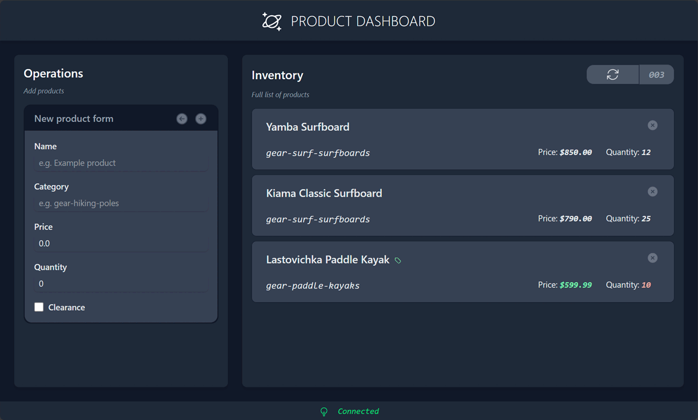

# Azure DocumentDB (with MongoDB compatibility) dashboard

This repository contains the source code for the Azure DocumentDB dashboard web application used in various Quickstart Azure Developer CLI (AZD) templates for [Microsoft Learn](https://learn.microsoft.com/azure/documentdb/).



## References

This web application is used in the following Quickstart AZD templates:

- [azure-samples/cosmos-db-mongodb-vcore-nodejs-quickstart](https://github.com/azure-samples/cosmos-db-mongodb-vcore-nodejs-quickstart)
- [azure-samples/cosmos-db-mongodb-vcore-python-quickstart](https://github.com/azure-samples/cosmos-db-mongodb-vcore-python-quickstart)
- [azure-samples/cosmos-db-mongodb-vcore-dotnet-quickstart](https://github.com/azure-samples/cosmos-db-mongodb-vcore-dotnet-quickstart)


> [!TIP]
> You can deploy any of these Quickstart AZD templates to host the target REST API that's used by this dashboard web application.

## Container image

The published container image can be found here:

- [ghcr.io/azure-samples/cosmos-db-mongodb-vcore-quickstart-web-dashboard](https://github.com/azure-samples/cosmos-db-mongodb-vcore-quickstart-web-dashboard/pkgs/container/cosmos-db-mongodb-vcore-quickstart-web-dashboard)

## Pre-requisites

- [Docker](https://www.docker.com/)
- [.NET 10](https://dotnet.microsoft.com/download/dotnet/10.0)
- [Node 20 or later](https://nodejs.org/download)

## Test locally

1. Navigate to the `src/web` directory:

    ```shell
    cd ./src/web/
    ```

1. Set the `SETTINGS:APIROOTENDPOINT` environment variable to the endpoint for your API using `dotnet user-secrets`:

    ```shell
    dotnet user-secrets set "SETTINGS:APIROOTENDPOINT" "<target-api-endpoint>"
    ```

1. Install the TailwindCSS Node packages:

    ```shell
    npm install tailwindcss @tailwindcss/cli
    ```

1. (Optional) Start the TailwindCSS CLI in `--watch` mode to regenerate the CSS file on-demand:

    ```shell
    npx @tailwindcss/cli --input wwwroot/app.css --output wwwroot/tailwind.css --watch
    ```

1. In parallel, start debugging the project in .NET:

    ```shell
    dotnet watch run
    ```

## Run published container image

1. Pull the latest version of the `ghcr.io/azure-samples/cosmos-db-mongodb-vcore-quickstart-web-dashboard` Docker container image from GitHub Container Registry:

    ```shell
    docker pull ghcr.io/azure-samples/cosmos-db-mongodb-vcore-quickstart-web-dashboard
    ```

1. Run the container with the following options:

    | | Value | Description |
    | --- | --- | -- |
    | **`--detach`** | `true` | Runs the container in the background |
    | **`--publish`** | `8080` | Attaches the port `8080` from the container to a random port on the host |
    | **`--env`** | `SETTINGS__APIROOTENDPOINT=<your-api-endpoint>` | Set to the target API endpoint |

    ```shell
    docker run --detach --publish 8080 --env "SETTINGS__APIROOTENDPOINT=<target-api-endpoint>" ghcr.io/azure-samples/cosmos-db-mongodb-vcore-quickstart-web-dashboard
    ```


## Configuration settings

| | Description | Default value |
| --- | --- |
| **`Settings:ApiRootEndpoint`** | The absolute URL endpoint to the backing API | *Not set* |
| **`Settings:StatusEndpoint`** | The relative endpoint to get the status of the connection to the database | `/status/` |
| **`Settings:RetrieveEndpoint`** | The relative endpoint to retrieve all documents from the collection | `/` |
| **`Settings:UpsertEndpoint`** | The relative endpoint to insert or replace a document in the collection | `/` |
| **`Settings:DeleteEndpoint`** | The relative endpoint to delete a document from the collection | `/` |
| **`Settings:ShowEndpoint`** | Flag that indicates whether the endpoint is rendered in the running application | `true` |
| **`Settings:HeaderSuffix`** | Suffix to append to the **H1** header on the web application | `""` *(Empty)* |

> [!TIP]
> In Linux environments, you may need to set the environment variable using **double underscores** instead of a colon. For example, `Settings:HeaderSuffix` would be `SETTINGS__HEADERSUFFIX` in a host like Azure Container Apps.
